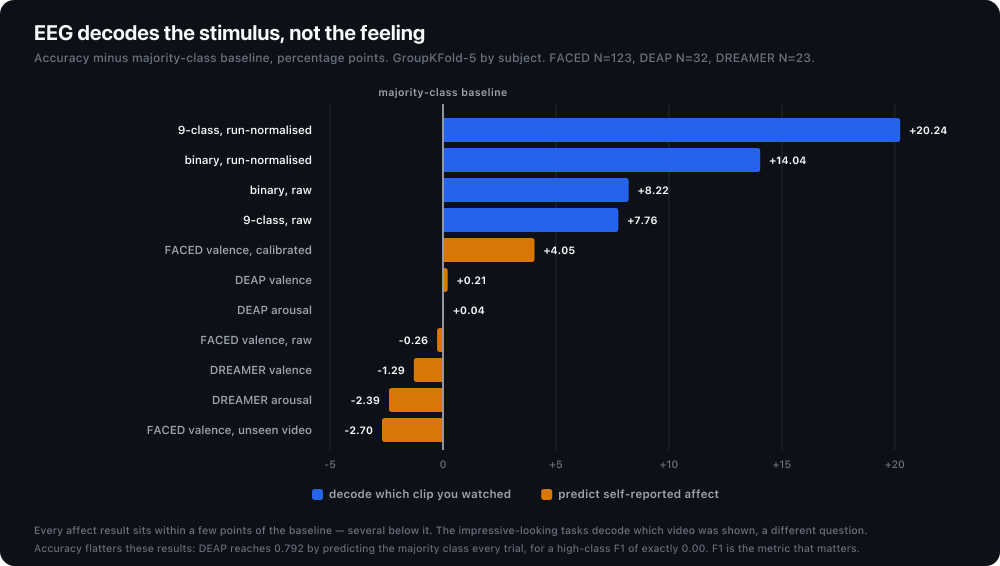

<p align="center">
  
</p>

<p align="center"><a href="https://github.com/QEbellavita/eeg-affect-honest-negatives/actions/workflows/test.yml"></a></p>

Can EEG predict how someone *felt* — their self-reported valence and arousal — for a person
the model has never seen?

No. Across DEAP, DREAMER and FACED, subject-independent EEG affect lands at the
majority-class baseline. The largest public set available (FACED, N=123) does not break the
ceiling. No model was committed from any of these runs.

This repository is the record: the pre-registrations, the code, the metrics, and the verdicts.

## The results

Every row is GroupKFold-5 **by subject** (no subject appears in both train and test), with
`class_weight='balanced'` and the scaler fit on the training fold only.

| Dataset | Task | Accuracy | Majority baseline | High-class F1 |
|---|---|---|---|---|
| DREAMER (23 subj) | valence | 0.593 | 0.606 | 0.24 |
| DREAMER | arousal | 0.539 | 0.563 | 0.40 |
| DEAP (32 subj) | valence | 0.792 | 0.790 | **0.00** |
| DEAP | arousal | 0.768 | 0.767 | **0.00** |
| **FACED (123 subj), unseen clips** | valence | **0.540** | 0.567 | 0.453 |
| FACED, unseen clips | arousal | 0.515 | 0.539 | 0.570 |

DEAP's 0.79 accuracy looks respectable until you notice the high-class F1 is exactly **0.00** —
the model predicts the majority class for every trial and collects the base rate. This is why
the primary metric here is minority/high-class F1, never accuracy.


<p align="center">
  
</p>

## The finding worth arguing about

FACED's published numbers are ~69.3% binary and ~35.2% nine-class. Those are **clip-category**
decoding — identifying which stimulus a subject watched, which is partly shared, stimulus-locked
EEG. That is a different question from generalizing *felt* affect across both people and stimuli.

The FACED spike separates the two in one harness:

1. **Step 1 reproduces the published result** — calibrated DE features reach 0.640 binary /
   0.345 nine-class, matching FACED's ~35.2%. This proves the pipeline is aligned and
   well-powered, so a null downstream can't be waved away as a broken setup.
2. **Step 3 runs leave-one-video-out**, so test clips are stimuli the model never saw.
   Valence high-class F1 *drops* from 0.486 (seen clips) to **0.453** (unseen), and accuracy
   0.540 falls **below** the 0.567 majority baseline.

The modest seen-clip signal was partly clip memorization. Under the honest control, felt affect
is at chance.

## Method

The discipline is the point:

- **GroupKFold by subject.** Random splits put the same person's trials in train and test; that
  leakage is what produces the good-looking published numbers this program exists to avoid.
- **Minority/high-class F1 as the primary metric**, because accuracy is base-rate-deceptive on
  these label distributions — see DEAP's 0.79-with-F1-0.00.
- **A kill criterion fixed before the run**, written into the pre-registration doc.
- **Gate-0 label-alignment assertions** — clips the source paper labels positive must score
  higher valence than clips it labels negative. This catches both the valence/arousal index
  confusion and the video-ordering join bug, either of which silently corrupts every downstream
  number.
- **A reproduction step before the novel claim**, so a null result is evidence about the world
  rather than evidence of a broken harness.

`PLAN_AFFECT_FACED.md` is the full execution plan for the FACED spike, written before it ran —
including the splitter design and the decision rule.

## Layout

```
*.md          pre-registrations and verdicts
spikes/       the training and data code
results/      metrics JSON emitted by each run
```

Read `HONEST_AFFECT_EEG_NEGATIVE.md` first (DEAP + DREAMER, the anchor), then
`HONEST_AFFECT_FACED.md` (the decisive N=123 run).

## Scope

This repository covers the **static, subject-independent** question: does a model trained on
other people generalize to a new one, with no adaptation. Work on per-subject adaptation and on
other physiological signals is not included here.

## Running it

```bash
uv venv .venv --python 3.12
uv pip install --python .venv/bin/python -r requirements.txt

PYTHONPATH=spikes .venv/bin/python -m pytest spikes/          # tests
PYTHONPATH=spikes .venv/bin/python spikes/train_faced_honest.py   # the decisive spike
```

Tests that need a licensed corpus **skip** rather than fail, so the suite exits clean on a
fresh clone with no data. Point `FACED_DL` (or `FACED_FEATURES_ZIP` / `FACED_CODE_ZIP` /
`FACED_STIMULI`) at your copy to activate them.

## Data is not included

No dataset, no raw EEG, no feature cache, and no per-subject record is redistributed here — only
code and aggregate metrics. Obtain each corpus from its own source under its own terms:

- **DEAP** — access requires a signed EULA. It forbids redistribution, which is why no DEAP
  feature cache appears in this repo even though the code will build and use one locally.
- **DREAMER** — request from its maintainers.
- **FACED** — openly downloadable from its own release.

Some documents describe `*_features_cache.npz` files as the mechanism that makes a run
reproducible without the multi-gigabyte raw signals. That is accurate, and the code will still
create them — but the caches themselves are derived dataset content, so none are published here.
Regenerate them from the raw corpora you have licensed.

## Citing

If you use these findings, cite via the repo's [CITATION.cff](CITATION.cff) (GitHub's "Cite
this repository" button), or the Zenodo DOI once archived.

## Licence

MIT — see [LICENSE](LICENSE). It covers the code and documents in this repository and nothing
else; it does not extend to any dataset you obtain separately.
